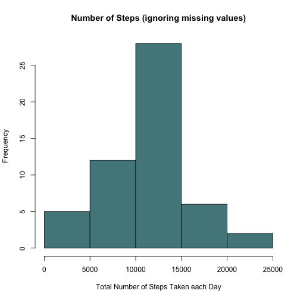
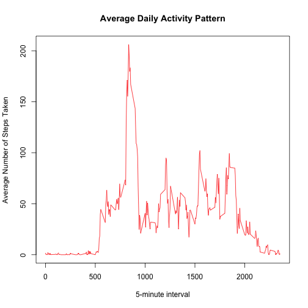
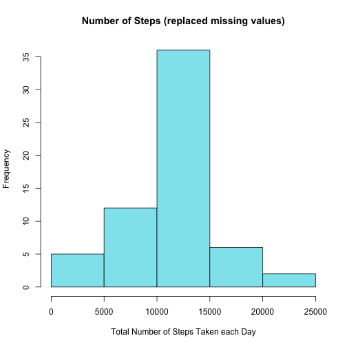
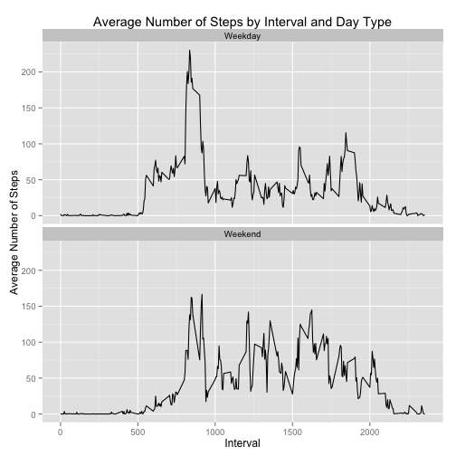

# Reproducible Research: Peer Assessment 1


This assignment makes use of data from a personal activity monitoring device. This device collects data at 5 minute intervals through out the day. The data consists of two months of data from an anonymous individual collected during the months of October and November, 2012 and include the number of steps taken in 5 minute intervals each day.

## Data

The data for this assignment can be downloaded from the course web site:

Dataset: [Activity monitoring data][1] [52K]
The variables included in this dataset are:

- **steps**: Number of steps taken in a 5-minute interval (missing values are coded as NA)

- **date**: The date on which the measurement was taken in YYYY-MM-DD format

- **interval**: Identifier for the 5-minute interval in which measurement was taken

The dataset is stored in a comma-separated-value (CSV) file and there are a total of 17,568 observations in this dataset.


## Loading and preprocessing the data

Show any code that is needed to

- Load the data (i.e. read.csv())

- Process/transform the data (if necessary) into a format suitable for your analysis  


Download, and extract the zipped activity.csv file stored within the [Activity monitoring data][1] link to your R working directory. After setting the working directory correctly (using the **setwd()** function for example), read the complete data set into one variable, and a subset of that data set containing only rows without missing values to another as shown below:


```r
# read complete raw data set into activity dataframe variable
activity <- read.csv("activity.csv", header = T)

# cast date and steps columns to date and integer types respectively

activity$date <- as.Date(activity$date)

activity$steps <- as.numeric(activity$steps)

# get subset of imported data frame that contains rows without NA values
activity_no_NA <- activity[complete.cases(activity),]
```

---
## What is mean total number of steps taken per day?

For this part of the assignment, you can ignore the missing values in the dataset.

1. Make a histogram of the total number of steps taken each day

2. Calculate and report the mean and median total number of steps taken per day


```r
# use tapply to obtain total number of steps by day (ignoring missing values)
total_steps_by_day <- tapply(as.numeric(activity_no_NA$steps),activity_no_NA$date, sum, na.rm = T)

# plot histogram
hist(total_steps_by_day, main = "Number of Steps (ignoring missing values)", xlab = "Total Number of Steps Taken each Day", col="cadetblue4")
```

 


```r
# aggregate mean and median number of steps by date

avg_steps_by_day <- tapply(activity_no_NA$steps,activity_no_NA$date, mean, na.rm = T)

median_steps_by_day <- tapply(activity_no_NA$steps,activity_no_NA$date,median, na.rm = T)


# get both mean and median number of steps across all dates
mean_steps <- mean(total_steps_by_day, na.rm=T) #returns 10766.19 or 10766 when rounded

median_steps <- median(total_steps_by_day, na.rm=T) #returns 10765
```

  
The mean number of steps is **10766.19** (*10766 rounded*)          

The median number of steps is **10765.00** (*10765 rounded*)                      


## What is the average daily activity pattern?

1. Make a time series plot (i.e. type = "l") of the 5-minute interval (x-axis) and the average number of steps taken, averaged across all days (y-axis)

2. Which 5-minute interval, on average across all the days in the dataset, contains the maximum number of steps?


```r
# return average number of steps by interval as a dataframe
avg_steps_by_interval <- as.data.frame(tapply(activity_no_NA$steps,activity_no_NA$interval,mean, na.rm = T))


# rename column header
colnames(avg_steps_by_interval) <- "avg_steps"


# add new "interval" column to store 5-interval names
avg_steps_by_interval$interval <- rownames(avg_steps_by_interval)


# plot average daily activity pattern
plot(avg_steps_by_interval$interval, avg_steps_by_interval$avg_steps, type = "l", col = "red", 
    xlab = "5-minute interval", ylab = "Average Number of Steps Taken", main = "Average Daily Activity Pattern")
```

 


```r
# returns 5 min interval with max avg of steps, i.e., INTERVAL 835
max_interval <- avg_steps_by_interval[which.max(avg_steps_by_interval$avg_steps),]$interval
```

Interval **835**, on average, across all the days in the dataset, contains the maximum number of steps.  


## Imputing missing values

Note that there are a number of days/intervals where there are missing values (coded as NA). The presence of missing days may introduce bias into some calculations or summaries of the data.

1. Calculate and report the total number of missing values in the dataset (i.e. the total number of rows with NAs)

2. Devise a strategy for filling in all of the missing values in the dataset. The strategy does not need to be sophisticated. For example, you could use the mean/median for that day, or the mean for that 5-minute interval, etc.    
*The strategy is to use the mean number of steps per 5-min interval across all dates to replace missing steps.*

3. Create a new dataset that is equal to the original dataset but with the missing data filled in.    
*A new dataframe activty_replace_NA is created to handle the replaced NA values. See below.*


4. Make a histogram of the total number of steps taken each day and Calculate and report the mean and median total number of steps taken per day. Do these values differ from the estimates from the first part of the assignment? What is the impact of imputing missing data on the estimates of the total daily number of steps?


```r
# gets the total number of missing values (NA)
num_NA <- sum(!complete.cases(activity))
```

The number of missing values is **2304**.


```r
#creates an extended dataframe of "activity" by adding the "avg_steps" column from dataframe "avg_steps_by_interval""
activity_replace_NA <- merge(activity, avg_steps_by_interval, by = "interval")

# sorts the dataframe by date and interval
activity_replace_NA <- activity_replace_NA[order(activity_replace_NA$date, activity_replace_NA$interval),]

# replaces missing (NA) steps in column "steps" with the average number of steps per interval, i.e., column "avg_steps"
activity_replace_NA[!complete.cases(activity_replace_NA),]$steps <- activity_replace_NA[!complete.cases(activity_replace_NA),]$avg_steps
```


```r
# use tapply to obtain total number of steps by day (replaced missing values)
total_steps_by_day_replaced <- tapply(as.numeric(activity_replace_NA$steps),activity_replace_NA$date, sum, na.rm = T)

# plot histogram
hist(total_steps_by_day_replaced, main = "Number of Steps (replaced missing values)", xlab = "Total Number of Steps Taken each Day", col="cadetblue2")
```

 


```r
# aggregate mean and median number of steps by date

avg_steps_by_day_replaced <- tapply(activity_replace_NA$steps,activity_replace_NA$date,mean)

median_steps_by_day_replaced <- tapply(activity_replace_NA$steps,activity_replace_NA$date,median)


# get both mean and median number of steps across all dates

mean_steps_replaced <- mean(as.numeric(total_steps_by_day_replaced))

median_steps_replaced <- median(total_steps_by_day_replaced)
```


The mean and median estimate number of steps in this new data set are **10766.19** and **10766.19** respectively, and therefore do not signficantly differ from the mean **10766.19** and median **10765.00** of the previous estimates. There is little impact imputing missing data on the estimates of the total daily number of steps.   


## Are there differences in activity patterns between weekdays and weekends?

For this part the weekdays() function may be of some help here. Use the dataset with the filled-in missing values for this part.

1. Create a new factor variable in the dataset with two levels - "weekday" and "weekend" indicating whether a given date is a weekday or weekend day.

2. Make a panel plot containing a time series plot (i.e. type = "l") of the 5-minute interval (x-axis) and the average number of steps taken, averaged across all weekday days or weekend days (y-axis). The plot should look something like the following, which was created using simulated data:


```r
# add new factor variable column called day_type to store value 'Weekend' or 'Weekday'
activity_replace_NA$day_type <- ifelse(weekdays(activity_replace_NA$date) %in% c('Saturday','Sunday')==TRUE, 'Weekend','Weekday')


# create dataframe with number of steps aggregated by interval and day_type
steps_by_intvl_daytype <- aggregate(steps ~ interval + day_type, activity_replace_NA, mean)
```


```r
library(ggplot2)

# plots average number of steps by interval and day type. Two graphs one for each day type are displayed
qplot(interval, steps, data=steps_by_intvl_daytype, geom=c("line"), xlab="Interval", ylab="Average Number of Steps", main="Average Number of Steps by Interval and Day Type") + facet_wrap(~ day_type, ncol=1)
```

 


[1]: https://d396qusza40orc.cloudfront.net/repdata%2Fdata%2Factivity.zip "Activity Data Set"
